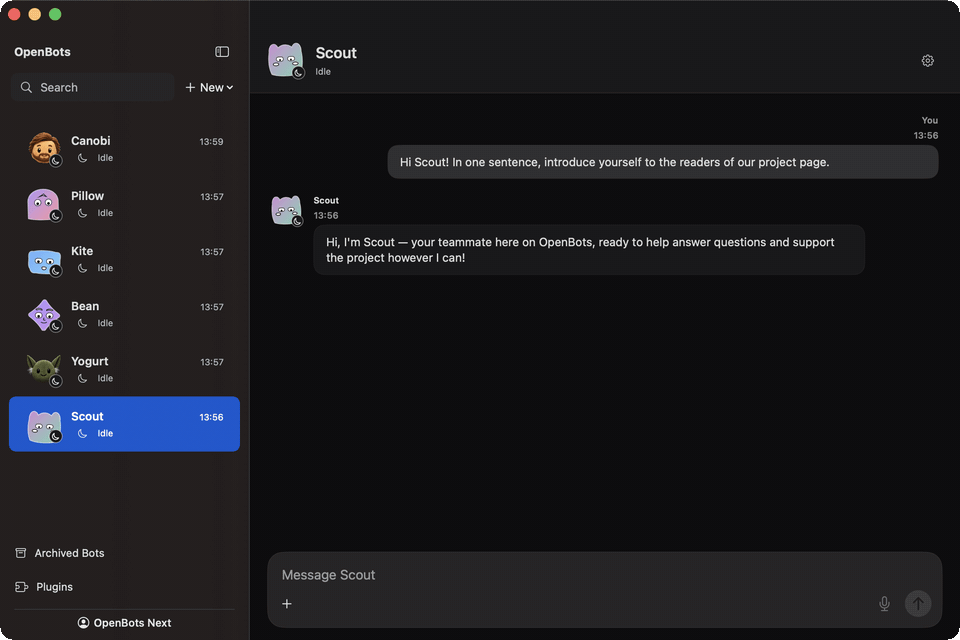

# OpenBots

**Persistent, named AI teammates as a native macOS app — rebuilt.**

OpenBots turns Claude into a team of named teammates you hire, brief, and fence yourself. This is the second-generation codebase (the "Next" rebuild): a modular Swift 6 / macOS 14 SwiftUI + AppKit app with durable local state, explicit approvals, and honest uncertainty — a saved plan is never presented as an executed action.


*Live capture of this build: six built-in characters, Scout answering through the local Claude Code CLI.*

> **Preview status, honestly stated.** This drop is a working preview. Chat, teammate identity, drafts, archives, search, durable history, and single live Claude replies through your local Claude Code CLI are implemented and tested (both XCTest and Swift Testing suites). The consequential-action *executor* is deliberately disabled in this build: the app records exact, immutable action proposals and approvals, but does not yet execute external actions. No telemetry, no accounts, no server — everything lives on your Mac.

## What's in the build

- **Chat-first native UI** — sidebar/detail, stable teammate identities and avatars, conversational hiring with explicit confirmation, per-conversation drafts, keyset-paged history, workspace search, archive/restore without data loss.
- **Durable local state** — protected SQLite (app-owned `0700` roots, `0600` files), atomic repositories, exact startup/reopen restoration, scoped Markdown memory with explicit non-authoritative snapshots.
- **Claude through your own CLI** — replies run as one local `claude` call against your existing Claude subscription. No API key, no credential harvesting: public network operations run through an isolated, credential-free wrapper (`Scripts/swiftpm-public.sh`), and authenticated access is always an explicit, visible step.
- **Approvals that mean something** — consequential actions become immutable proposals whose exact payload you see and approve; a simulated acknowledgement is never treated as acceptance, and an approval is never silently treated as execution or a capability grant.
- **Attachments and previews** — durable owned attachments, in-chat saved text, image and static-PDF preview with scope fences and cancellation.

## Requirements

- macOS 14+ on Apple Silicon
- Full Xcode (16+, Swift 6 toolchain) to build — Command Line Tools alone are not enough
- [Claude Code CLI](https://claude.com/claude-code) with an active subscription, for live replies

## Build and run

```sh
Scripts/build-preview.sh
open ".build.noindex/preview/DerivedData/Build/Products/Debug/OpenBots Next Preview.app"
```

Or one line in Terminal (fetches the latest release, builds locally — a locally built app is not quarantined):

```sh
curl -fsSL https://raw.githubusercontent.com/LorenzoColombani/openbots/main/install.sh | sh
```

## Tests

```sh
DEVELOPER_DIR=/Applications/Xcode.app/Contents/Developer \
  Scripts/swiftpm-public.sh test --scratch-path .build.noindex/gate
```

The suite is mixed XCTest + Swift Testing (see `Scripts/test-inventory.txt` for the frozen counts of this drop). CI runs the same wrapper plus forbidden-content scans on every push.

## Data, privacy, legal

All state lives under your `~/Library/Application Support` in an app-owned folder. Nothing leaves your Mac except the Claude calls you make through your own CLI login. See `PRIVACY.md`, `TERMS.md`, and `SECURITY.md`.

## Why v0.5.0 — and why it looks smaller than v0.1.0

This is a deliberate rebuild, not a feature release. v0.1.0 (developed under the working name *Agency*; the repo keeps that release for history) proved the product but outgrew its foundations. So the app was rebuilt from a clean slate: durable SQLite persistence (the system library directly — zero third-party dependencies), a stricter security boundary, honest approval semantics, and a simpler Claude sign-in.

The old app had more features on the surface — web search, connectors, a shared vault. Those aren't gone; they're being **reintroduced one by one on the new architecture**, each landing more robust than its v0.1 version, and faster now that the foundations don't fight back. v0.5.0 is the midpoint of that road: fewer visible features than v0.1.0, a much better app underneath. The version number is a promise about trajectory — what v0.1.0's users never got to see ships as this line reaches v1.0.

Designed and developed by Lorenzo Colombani; implementation is AI-assisted under his direction and review.

MIT licensed. Issues and PRs welcome — read `SECURITY.md` before reporting anything security-shaped.
