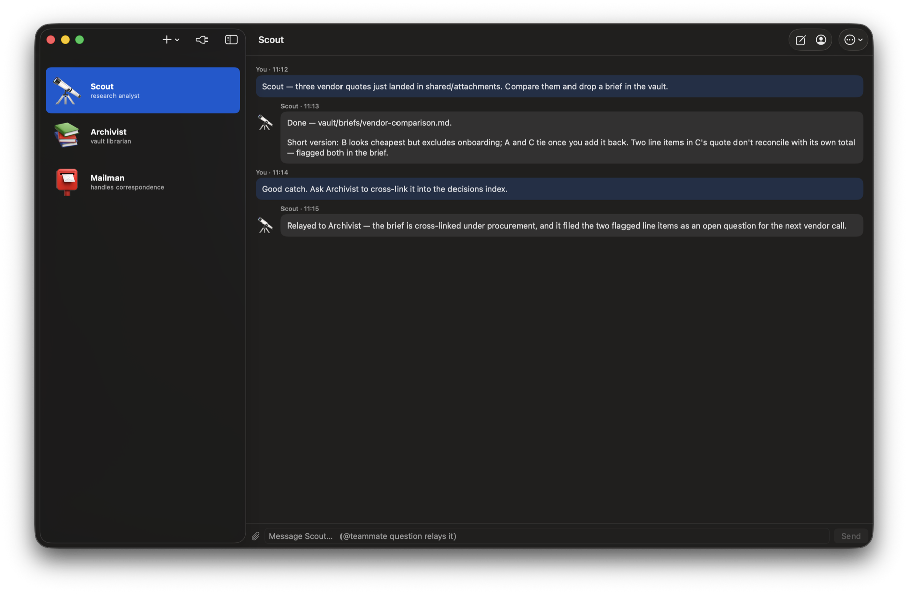

# Agency

A native macOS app that turns Claude into a **team of persistent, named AI teammates** — each one a real, resumable [Claude Code](https://claude.com/claude-code) session with its own personality, memory, permissions, and sandbox, all sharing an Obsidian-compatible vault and visibly handing work to each other.

Think group chat, except every participant is an agent you hired, briefed, and fenced yourself — and the seventh seat is you.

  [](https://github.com/LorenzoColombani/agency/actions/workflows/ci.yml) 


*Staged demo data — three hired teammates; Scout's thread after a vault-brief request.*

## What it does

- **Persistent teammates.** Each conversation is a headless `claude -p --resume` session. Teammates keep their memory across app restarts, days, and machine reboots — a real session, not a prompt with a wig.
- **Visible agent-to-agent handoffs.** `@teammate question` in a thread relays the question agent-to-agent; multi-line `RELAY` blocks let agents delegate mid-answer. Every leg renders in the UI — no invisible orchestration.
- **Group threads.** Teams of up to 6 agents share a thread; per-member cursor deltas make group chat coherent over independent sessions, with the human as the fan-in.
- **A shared vault.** Obsidian-compatible Markdown, with per-agent private pockets, per-team pockets, and a provenance ledger that flags cross-agent overwrites *and* files planted where they don't belong.
- **Connectors.** Optional per-agent grants: a service-aware Apple Messages MCP server (picks iMessage / RCS / SMS from chat history instead of guessing), an Apple Mail sender (no default account, signature-aware, phantom-window-proof), Google Workspace, browsers, shell.
- **File attachments.** Drag files onto a thread or use the picker; copies are staged where every fenced agent can read them, symlinks refused, names sanitized.

## Why the engineering is interesting

**No API key anywhere.** The whole thing rides a claude.ai subscription through the Claude Code CLI. Child processes strip `ANTHROPIC_API_KEY` defensively; billing never touches a key.

**Two-half fencing.** Every teammate is contained twice, because the two halves fail differently:
1. *Settings deny rules* (`Read(path)` / `Edit(path)` patterns in per-agent `settings.json`) bind the CLI's file tools.
2. *Seatbelt profiles* (`sandbox-exec`) bind everything else — Bash isn't subject to tool rules, so shell agents get kernel-level write fences, sealed pockets both ways, and path resolution via `realpath(3)` (Swift's `resolvingSymlinksInPath()` silently skips `/var`, which would fail open).

**A network egress fence.** Each fenced run gets its own loopback CONNECT proxy; Seatbelt denies every other outbound route. Allowlisted hosts tunnel through a blind TCP relay (no TLS interception), everything else is refused *visibly* — a tricked agent's exfil attempt becomes a thread notice, not a silent failure. Ports are allowlisted too (a host-only allowlist would tunnel `CONNECT host:25`), and the listener binds `127.0.0.1` only.

**Prompt-injection is treated as weather, not surprise.** Untrusted material (web content, incoming messages) is fenced and neutralized, never silently censored; the test suite includes live-style injection fixtures — forged authorship, exfil instructions, lookalike hosts, bidi/invisible-character address spoofing — and the MCP servers reject the invisible-character class outright.

**The AppleScript layer is injection-proof by construction.** Recipients and bodies travel as `argv` into `on run argv` — nothing is ever interpolated into a script string. The Messages server picks the delivery service from three tiers of chat.db evidence (per-message service, thread service, handle service) because `buddy X of <service>` never errors — "try iMessage, catch, fall back" is impossible, so hope is not a routing strategy.

**Everything is verified, not vibed.** 379 mock-driven tests (no live calls in `swift test`), red-green proofs for every bug fix, live smoke scripts run only at gates, and a written feasibility study in which every engine claim was tested on a real machine before a line of app code existed.

**Full design document: [`docs/ARCHITECTURE.md`](docs/ARCHITECTURE.md).**

## Architecture

```
┌────────────────────────────────────────────────────────────┐
│ AgencyApp (SwiftUI)                                        │
│   threads · group chat · queues · attachment chips · stops │
├────────────────────────────────────────────────────────────┤
│ AgencyKit                                                  │
│   AgentStore      roster, personas, settings, pockets      │
│   SessionRunner   claude -p lifecycle, stream-json events  │
│   SandboxProfile  Seatbelt generation (realpath'd)         │
│   EgressProxy     loopback CONNECT allowlist proxy         │
│   TeamThreads     group keys, cursor deltas, dispatch      │
│   Attachments     staging, sanitizing, retention           │
│   VaultProvenance ledger, overwrite + planted-file alarms  │
├────────────────────────────────────────────────────────────┤
│ Resources/mcp                                              │
│   messages-server.js   service-aware Apple Messages        │
│   apple-mail-send.js   account-explicit Apple Mail sender  │
└────────────────────────────────────────────────────────────┘
```

Runtime data (agents, vault, roster, staged files) lives in `~/Library/Application Support/Agency` by default — set `AGENCY_ROOT` to relocate it (the CLI uses the current directory). None of it is ever committed; the tree is engine only.

## Install

Requirements:

- **macOS 14+** on Apple silicon or Intel.
- **Full Xcode** (free, App Store). The Command Line Tools alone cannot run the test suite — `swift test` fails with `no such module 'XCTest'`. If `xcode-select -p` prints a `CommandLineTools` path, either switch it (`sudo xcode-select -s /Applications/Xcode.app`) or prefix commands with `DEVELOPER_DIR=/Applications/Xcode.app/Contents/Developer`.
- **The [Claude Code CLI](https://claude.com/claude-code)**, logged into a Claude subscription (`claude` should work in your terminal). No API key — see above.
- **`node` on PATH** (only needed for the Messages/Mail connectors).

```bash
git clone https://github.com/LorenzoColombani/agency
cd agency
swift test                      # optional sanity check — 379 tests, no live calls
bash scripts/make-app.sh        # builds + signs dist/Agency.app
cp -R dist/Agency.app /Applications/   # optional, or run it from dist/
open dist/Agency.app
```

The build script signs with whatever Apple Development identity it finds (macOS TCC permissions — Automation, Full Disk Access — are tied to the signature; ad-hoc fallback works but re-prompts after every rebuild).

## Using it

1. **Hire a teammate**: click **+**, give it a name, an emoji, and a role.
2. **It interviews itself into the job**: the new teammate opens with a short onboarding conversation in its thread — answer its questions and it configures its own persona; you approve any capability grants.
3. **Talk.** Message a teammate directly, `@teammate question` from another thread to relay agent-to-agent, or create a team for a group thread. Attach files with the paperclip or by dropping them on the thread.
4. **Grant connectors** per agent (the plug icon): Messages, Mail, Google Workspace, browsers, shell. Everything is deny-by-default; an ungranted agent stays fenced.

**Cost**: every message you send (and every relay leg between agents) is one real `claude -p` call billed against the connected subscription. The test suite and the build are free.

**Your data**: everything lives in `~/Library/Application Support/Agency` (agents, threads, vault — the vault opens directly in Obsidian). Set `AGENCY_ROOT` to relocate it. Uninstall = delete the app and that folder; nothing else is touched.

`agency-cli` (same package) drives everything headlessly — create agents, chat, refresh policies — and is what the live smoke scripts use. It uses the current directory as its root, which makes scratch experiments trivial.

## Honest caveats

- This is a personal project extracted from a private repo; the operator is addressed as "Lorenzo" throughout the personas and provenance — rename to taste.
- Live usage bills the connected subscription. The smoke scripts say so loudly and are not run by tests.
- The Messages/Mail connectors automate the *user's own* apps via their existing TCC grants; they are built for a single-user Mac, not multi-tenancy.

## Status

**This is a first release (v0.1.0) — use it with care.** It works and is used daily by its author, but it is one person's app, not a hardened product: expect rough edges, read what you grant before you grant it (a teammate with Mail or Messages access sends real mail and real messages, as you), and keep an eye on the subscription usage your conversations spend. The fences are engineered and tested — but no sandbox makes a careless grant safe.

Beyond that: working, used daily, reviewed hard (every feature ships through verification, live probing, and adversarial code review — several of the fence rules above exist because a review round broke the previous version).

## License

MIT — see [LICENSE](LICENSE).

Not affiliated with Anthropic. Built by [Lorenzo Colombani](https://github.com/LorenzoColombani).
