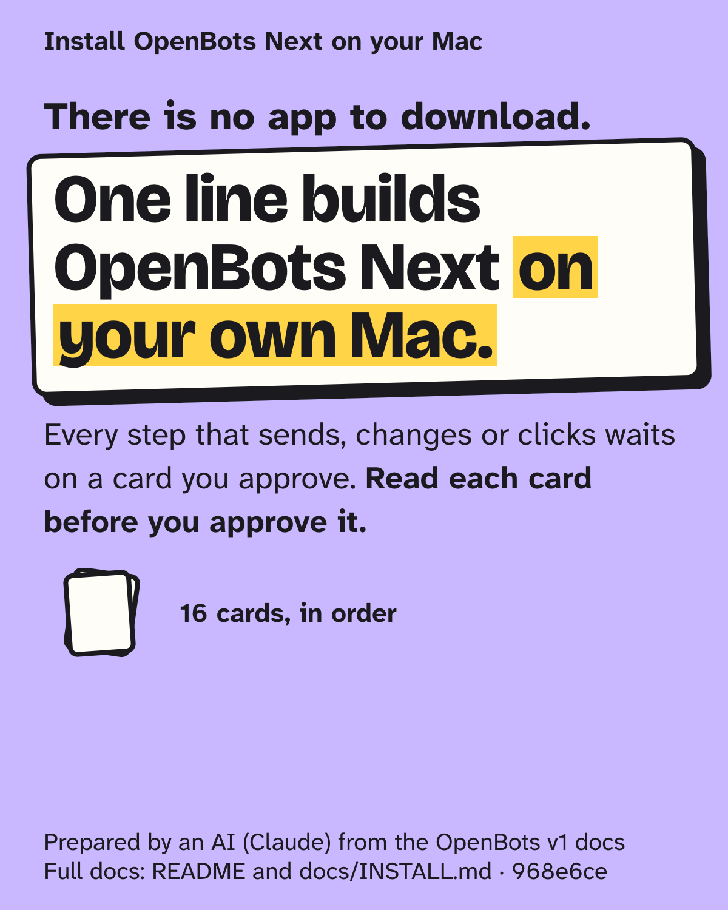

# OpenBots

**Persistent, named AI teammates as a native macOS app — rebuilt.**

[](https://github.com/LorenzoColombani/openbots/actions/workflows/ci.yml) [](https://github.com/LorenzoColombani/openbots/releases/latest)    [](LICENSE)

OpenBots turns Claude into a team of named teammates you hire, brief, and fence yourself. The app you install is called **OpenBots Next**: that is the name you will see in `/Applications`, the Dock and System Settings. This is the second-generation codebase (the "Next" rebuild): a modular Swift 6 / macOS 14 SwiftUI + AppKit app with durable local state, explicit approvals, and honest uncertainty — a saved plan is never presented as an executed action.


*Live capture of an earlier build: Scout answering through the local Claude Code CLI.*

> **Status: v1.** Bots chat, work in their own folders, search and fetch the web, run code, hire helpers, hand work to each other, and use your Mac's apps through connectors. Every consequential step (a send, a script, a click on your screen) waits on a card you approve. No telemetry, no accounts, no server: everything lives on your Mac, and Claude runs through your own Claude Code login.

## What's in the build

- **Chat-first native UI** — sidebar/detail, stable teammate identities and avatars, conversational hiring with explicit confirmation, per-conversation drafts, keyset-paged history, workspace search, archive/restore without data loss.
- **Durable local state** — protected SQLite (app-owned `0700` roots, `0600` files), atomic repositories, exact startup/reopen restoration, scoped Markdown memory with explicit non-authoritative snapshots.
- **Claude through your own CLI** — replies run as one local `claude` call against your Claude Pro or Max plan, signed in on the app's own Claude Code profile. No API key, no credential harvesting: public network operations run through an isolated, credential-free wrapper (`Scripts/swiftpm-public.sh`), and authenticated access is always an explicit, visible step.
- **Approvals that mean something** — consequential actions become immutable proposals whose exact payload you see and approve; a simulated acknowledgement is never treated as acceptance, and an approval is never silently treated as execution or a capability grant.
- **Attachments and previews** — durable owned attachments, in-chat saved text, image and static-PDF preview with scope fences and cancellation.
- **Per-bot switches** — each bot has its own switches for work on this Mac, web search, web fetch, hiring, and every connector; nothing is on until you turn it on for that bot.
- **Connectors** — Apple Mail (read, and send as you), Messages (iMessage, RCS, SMS), Contacts and Calendar (read-only), Apple Notes and Control Chrome (Anthropic's Claude Desktop extensions), a browser through chrome-devtools-mcp, Gmail, Google Calendar and Google Drive (through a separate Google account you connect), and Control this Mac (through Peekaboo). Each call that acts shows a card first. What each needs: [docs/CONNECTORS.md](docs/CONNECTORS.md).
- **Teams and handoffs** — bots hand work to each other in view, and a bot can hire a new bot or a short-lived worker for one job.

## What it does not do

- **No API key, no accounts, no server, no telemetry.** Replies go through your own
  Claude Code login; nothing is sent to the developer.
- **Nothing runs unasked.** Beyond chat, every ability is off until you switch it on
  for a bot, and anything consequential waits on a card. A bot cannot turn on its
  own connectors, hiring or Control this Mac.
- **No background running.** Closing the last window quits the app, and it installs
  no login item or background service.
- **No guarantee against a bot being fooled.** Bots are language models: they can be
  wrong, and a mail or web page can try to steer them. Text from outside is marked
  as untrusted before a bot reads it, which lowers the risk without removing it.
  Read each card before you approve it.
- **No prebuilt app.** You build it on your Mac (the installer does it for you).

## Before you install

- An Apple Silicon Mac on macOS 14 or later (Control this Mac needs macOS 15).
- Full **Xcode 16.3+** at `/Applications/Xcode.app`. Command Line Tools alone are not
  enough.
- **Claude Code from Anthropic's native installer** (`curl -fsSL https://claude.ai/install.sh | bash`)
  and a **Claude Pro or Max** plan. An npm or Homebrew install of Claude Code, an API
  key, a Team or an Enterprise login is not accepted. OpenBots Next signs in to Claude
  with its own profile, separate from your Terminal login.
- For connectors, **Node.js** from Homebrew or nodejs.org (at `/opt/homebrew/bin/node`
  or `/usr/local/bin/node`; nvm, volta or asdf installs are not found), plus what each
  connector needs.
- **Google needs your own sign-in client.** Gmail, Google Calendar and Google Drive
  work only after you create a Google Desktop OAuth client and build its ID in:
  [the Google setup guide](docs/guides/google-setup.md) walks through it.

Details, permissions, updating and removal: **[docs/INSTALL.md](docs/INSTALL.md)**.
Every connector and what it needs: **[docs/CONNECTORS.md](docs/CONNECTORS.md)**.

## Install

<a href="https://lorenzocolombani.github.io/openbots/guides/install-guide.html"></a>

**New to this? Start with the [install guide](https://lorenzocolombani.github.io/openbots/guides/install-guide.html):** the steps as 16 short cards, with a Copy button on every command. The same cards as [pictures](docs/guides/install-cards/README.md), and every detail in [docs/INSTALL.md](docs/INSTALL.md).

The one line:

```sh
curl -fsSL https://raw.githubusercontent.com/LorenzoColombani/openbots/main/install.sh | sh
```

It checks your Mac, downloads the latest release, builds it locally (a few minutes
the first time), puts **OpenBots Next.app** in `/Applications` and opens it. A
locally built app is not quarantined, so there is no Gatekeeper warning. With Google,
replace the sample ID below with your own Client ID:

```sh
curl -fsSL https://raw.githubusercontent.com/LorenzoColombani/openbots/main/install.sh \
  | OPENBOTS_GOOGLE_OAUTH_CLIENT_ID=1234-abcd.apps.googleusercontent.com sh
```

Or from a clone:

```sh
Scripts/build-preview.sh
open ".build.noindex/preview/DerivedData/Build/Products/Debug/OpenBots Next.app"
```

Then, in the app: **Settings → General & Claude Code → Check Claude**, sign in with
your Claude Pro or Max account, and create a bot.

## Tests

```sh
DEVELOPER_DIR=/Applications/Xcode.app/Contents/Developer \
  Scripts/swiftpm-public.sh test --no-parallel --scratch-path .build.noindex/gate
```

3,196 tests (XCTest + Swift Testing), serial, with no live calls: Claude Code's wire
format is replayed from recorded runs. CI runs them on macOS 15 and 26, plus the
forbidden-content scan, on every push. See [CONTRIBUTING.md](CONTRIBUTING.md).

## Data, privacy, legal

The app's records live in an app-owned folder under `~/Library/Application Support`, and your bots' working files in `~/OpenBots Next Preview Content`. What leaves your Mac is what you switch on: Claude replies through your own login, the web for bots you allow it, and the accounts you connect. See [PRIVACY.md](PRIVACY.md), [TERMS.md](TERMS.md) and [SECURITY.md](SECURITY.md).

## From v0.5.0 to v1

v0.5.0 was the rebuild's midpoint: a new foundation (durable SQLite persistence on the system library, a stricter security boundary, honest approval semantics) with fewer visible features than v0.1.0. v1 brings the old app's abilities back on that foundation: web access, connectors, teams, hiring, running code and control of the Mac, each behind the same approval cards. The full list is in [CHANGELOG.md](CHANGELOG.md).

## Design credits

Some of OpenBots' team features were shaped by studying xAI's Grok Bot app. Earlier releases credited these ideas in code comments: teams of two to six bots, a 4,000-character limit on a bot's instructions, saving a message before it is sent, a read-only mode for side conversations, and copying a bot. The list of actions a bot had to ask about before doing them followed safety guidance xAI has published.

Later sources use neutral names for the tests and notes that grew out of that study. No code, text or screens from Grok Bot are included.

Grok and xAI are trademarks of their owner. OpenBots is not affiliated with or endorsed by xAI.

Designed and developed by Lorenzo Colombani; implementation is AI-assisted under his direction and review.

[MIT licensed](LICENSE). Issues and PRs welcome: see [CONTRIBUTING.md](CONTRIBUTING.md), and read [SECURITY.md](SECURITY.md) before reporting anything security-shaped.
