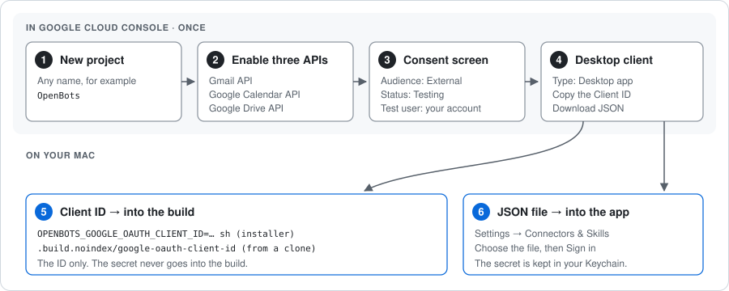

# Connect Gmail, Google Calendar and Google Drive

OpenBots Next does not ship a Google sign-in of its own. Google only lets an app read
Gmail if the app's developer passes a review, and a source release has no single
developer to review. So **you create your own Google sign-in client**, build it
into your copy of the app, and sign in with it. It takes about fifteen minutes,
once.



> **Use a separate Google account.** The app calls it "the separate OpenBots Google
> account" everywhere. Bots can read its mail, draft (and, if you allow it, send)
> as it, and read its calendar and Drive. Give it only what you want bots to see,
> for example by forwarding or sharing into it.

## What you get

| Connector | What a bot can do | Card before it acts |
|---|---|---|
| Gmail | search and read mail, write drafts | no, reading and drafting are not sends |
| Gmail send | send mail | yes, every message, on its own switch |
| Google Calendar | read calendars and events | no, read-only |
| Google Drive | search and read files | no, read-only |

Every connector is off until you turn it on for a bot, under that bot's Access.

The scopes the app asks Google for are `gmail.readonly`, `gmail.compose`,
`calendar.calendarlist.readonly`, `calendar.events.readonly` and `drive.readonly`.
`gmail.compose` is the scope that allows drafts, and Google's own wording is that it
also allows sending; the app shows you that on the sign-in screen. The app itself
sends only through the Gmail send connector, and only after you approve the card.

## 1. Create a Google Cloud project

1. Sign in to <https://console.cloud.google.com> with the Google account you will
   connect. (Any account can own the project; using the same one keeps it simple.)
2. Open the project picker at the top and choose **New project**. Name it, for
   example, `OpenBots`, and create it. Make sure it is the selected project.

## 2. Turn on the three APIs

In **APIs & Services → Library**, search for each of these and press **Enable**:

- **Gmail API**
- **Google Calendar API**
- **Google Drive API**

If you skip one, the app later says which API is switched off and links to its
Enable page.

## 3. Set up the consent screen

Google calls this part the **Google Auth Platform** (older consoles call it the
*OAuth consent screen*).

1. **Google Auth Platform → Branding** (or **Get started**): an app name such as
   `OpenBots (personal)` and your email as the support email.
2. **Audience**: choose **External**, and leave the publishing status on
   **Testing**.
3. Still in **Audience**, under **Test users**, press **Add users** and add the
   Google account you will connect. Only test users can sign in to an app in
   Testing.
4. Give a contact email and accept the Google API Services User Data Policy.

You do not need to submit anything for verification. While you sign in, Google
shows a warning that the app is not verified; this is your own app, so continue.

> **Seven days.** Google expires the sign-in of an app in Testing after seven
> days. When the Google connectors stop working, open Settings → Connectors &
> Skills and sign in again.

## 4. Create a Desktop client

1. **Google Auth Platform → Clients → Create client**.
2. **Application type: Desktop app**. Name it `OpenBots`. Press **Create**.
3. In the dialog that follows, press **Download JSON** and keep the file somewhere
   private. It holds the client secret, and Google may show the secret only once.
4. Copy the **Client ID**. It looks like `1234-abcd.apps.googleusercontent.com`.

It must be a **Desktop** client. The app refuses a Web client's file and says so.

## 5. Build the client ID into the app

The client ID goes into the app when it is built. The secret never does: you
choose the JSON file inside the app in step 6, and it is kept in your Keychain.

**With the one-line installer**, put the ID in front of `sh`:

```sh
curl -fsSL https://raw.githubusercontent.com/LorenzoColombani/openbots/main/install.sh \
  | OPENBOTS_GOOGLE_OAUTH_CLIENT_ID=1234-abcd.apps.googleusercontent.com sh
```

**From a clone**, write it to the file the build reads, then build:

```sh
mkdir -p .build.noindex
echo 1234-abcd.apps.googleusercontent.com > .build.noindex/google-oauth-client-id
Scripts/build-preview.sh
```

`.build.noindex/` is ignored by git, so the ID stays out of your commits. Rebuild
the same way after every update, or the new copy of the app has no Google client.

A build without a client ID still shows the Google rows, marked **needs setup**,
with both buttons off: "This build needs a new Google Desktop OAuth client before
the account can be connected."

## 6. Connect the account in the app

1. Open **Settings → Connectors & Skills**.
2. Press **Choose the Google sign-in file…** and pick the JSON file from step 4.
   The app checks that it is a Desktop client and that its ID matches the one
   built into the app, then keeps only the secret, in your Keychain.
3. Press **Sign in to Google…**. Your browser opens Google's sign-in. Choose the
   test user from step 3, continue past the "unverified app" warning, and allow
   the listed access. The browser hands back to the app on a local address
   (`127.0.0.1`); you have five minutes before the attempt times out.
4. Turn the Google connectors on for the bots that need them, under each bot's
   Access.

If your Mac asks whether the Google helper may use your Keychain, allow it. An app
built without an Apple Development certificate is signed ad hoc, and macOS then
treats every rebuild as a new program: expect the question again after each
rebuild, and answer it, or the Google connectors stay unavailable.

## Disconnect

**Disconnect Google account** in Settings → Connectors & Skills stops the app using the account on
this Mac first, then asks Google to end its access and forgets the sign-in. If you
are offline, it finishes the Google side later. After you connect again, allow the
account for each bot again. You can also remove access from the Google side at
<https://myaccount.google.com/permissions>.

## Troubleshooting

| What you see | What to do |
|---|---|
| "That file describes a Web OAuth client" | Create a **Desktop app** client (step 4). |
| "…belongs to a different Google OAuth client" | The file is not the one whose ID you built in. Pick the right file, or rebuild with this client's ID. |
| "Google sign-in timed out. Nothing was connected." | Start again and finish in the browser within five minutes. |
| An API "is switched off" | Enable it in **APIs & Services → Library** (step 2). |
| Access denied at Google | Add the account as a test user (step 3). |
| Worked for a week, then stopped | The Testing sign-in expired. Sign in again. |
