# Install OpenBots Next: the guide in 16 cards

Read the cards in order. Every command on a card is repeated under it as text, so you can copy it on your Mac: pictures cannot be copied.

Without Google, skip cards 5, 8 and 14.

Prepared by an AI (Claude) from the OpenBots v1 docs (commit 968e6ce). The docs are the full reference: [README](https://github.com/LorenzoColombani/openbots/blob/main/README.md), [docs/INSTALL.md](https://github.com/LorenzoColombani/openbots/blob/main/docs/INSTALL.md), [docs/CONNECTORS.md](https://github.com/LorenzoColombani/openbots/blob/main/docs/CONNECTORS.md), [docs/guides/google-setup.md](https://github.com/LorenzoColombani/openbots/blob/main/docs/guides/google-setup.md), [PRIVACY.md](https://github.com/LorenzoColombani/openbots/blob/main/PRIVACY.md). The same cards as one scrolling page, with Copy buttons: [../install-guide.html](../install-guide.html) (download it and open it in your browser).

## 1 of 16 · Install OpenBots Next on your Mac


## 2 of 16 · Your Mac and Xcode

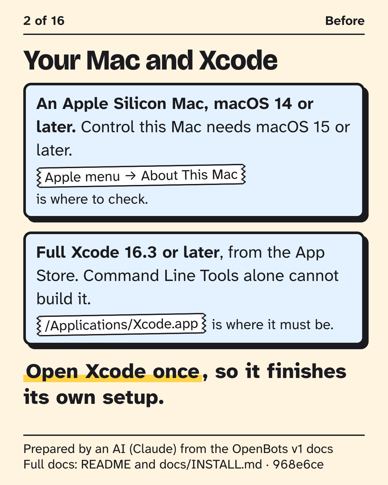

## 3 of 16 · Claude Code

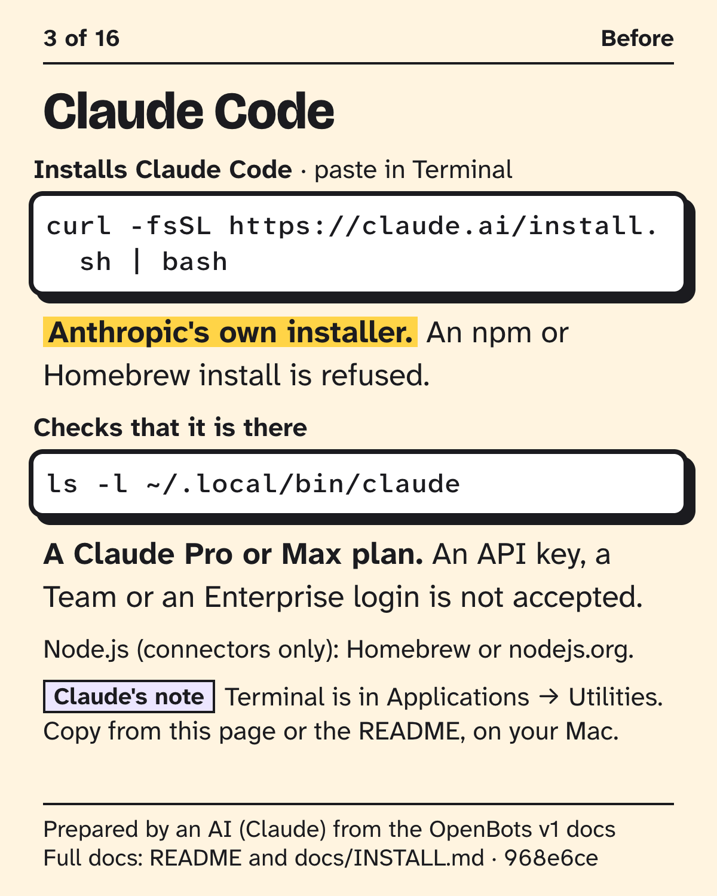

Installs Claude Code, paste in Terminal:

```sh
curl -fsSL https://claude.ai/install.sh | bash
```

Checks that it is there:

```sh
ls -l ~/.local/bin/claude
```

## 4 of 16 · Gmail, Google Calendar or Google Drive?

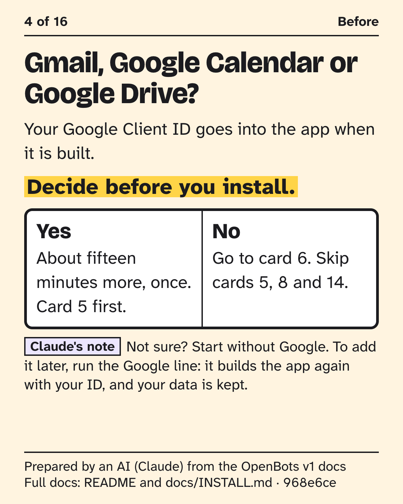

## 5 of 16 · Your own Google sign-in (only if you want Google)


## 6 of 16 · The one line

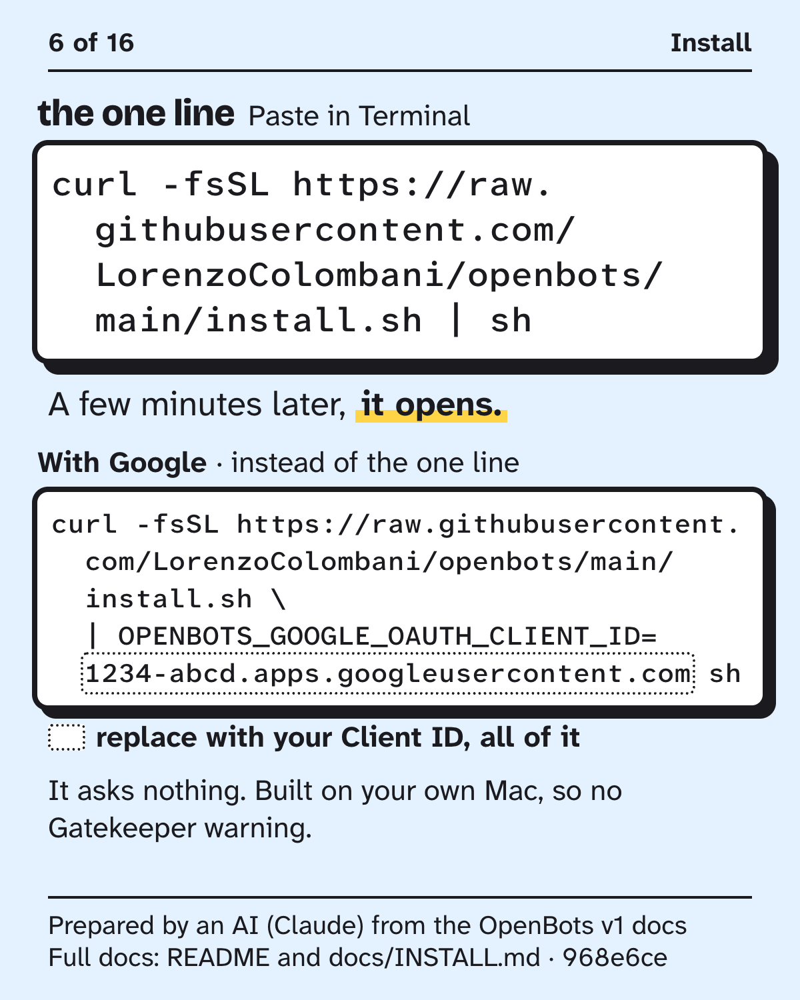

The one line, paste in Terminal:

```sh
curl -fsSL https://raw.githubusercontent.com/LorenzoColombani/openbots/main/install.sh | sh
```

With Google, instead of the one line. Replace `1234-abcd.apps.googleusercontent.com` with your own Client ID, all of it, before you run it:

```sh
curl -fsSL https://raw.githubusercontent.com/LorenzoColombani/openbots/main/install.sh \
  | OPENBOTS_GOOGLE_OAUTH_CLIENT_ID=1234-abcd.apps.googleusercontent.com sh
```

## 7 of 16 · Check, sign in, say hello


## 8 of 16 · Connect Google in the app (only if you want Google)

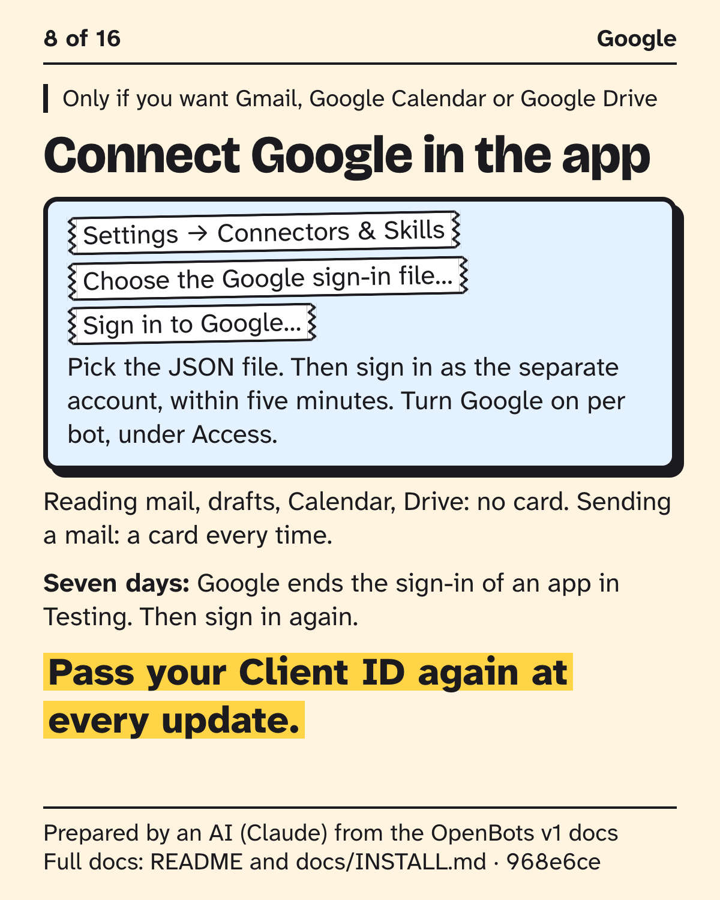

## 9 of 16 · Approval cards

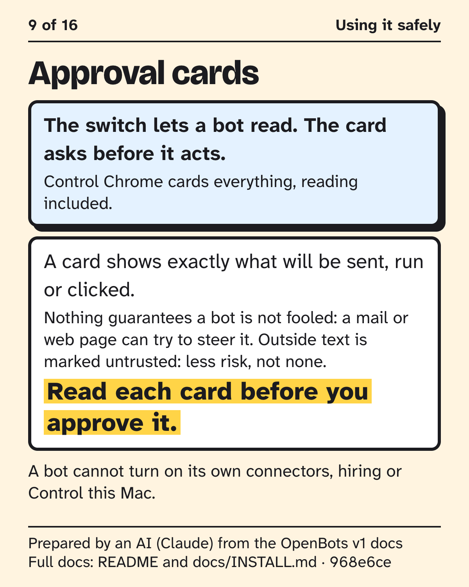

## 10 of 16 · Control this Mac

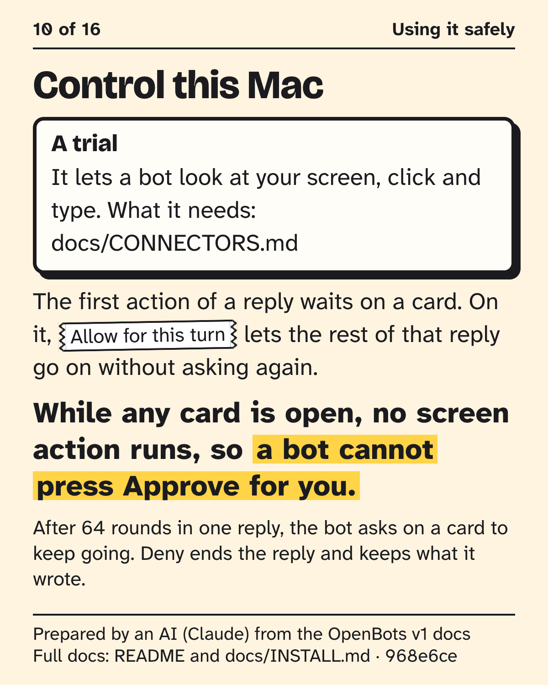

## 11 of 16 · macOS will ask

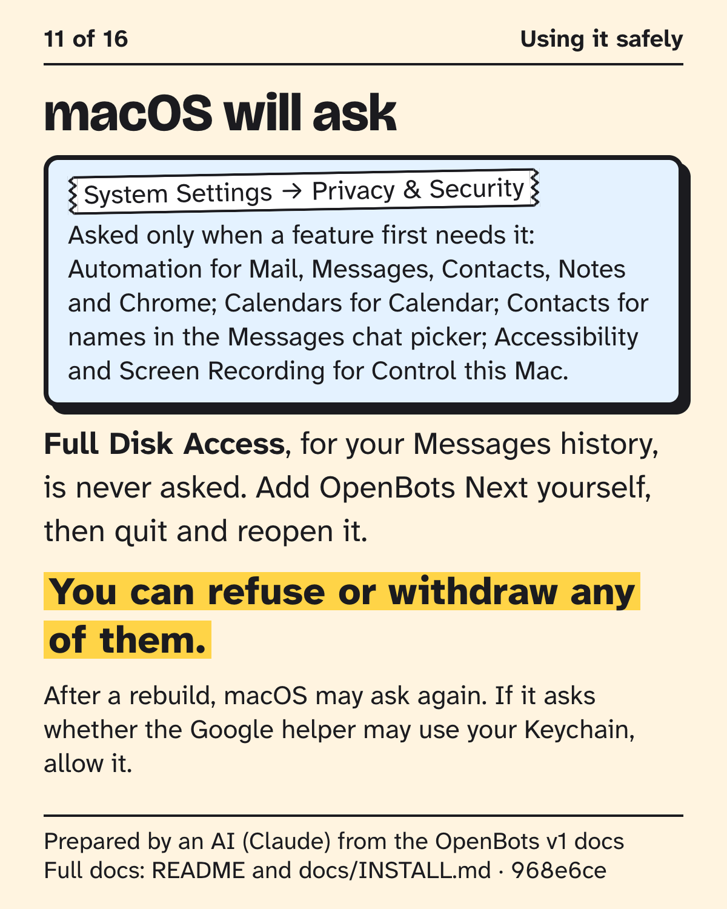

## 12 of 16 · If something goes wrong: in Terminal

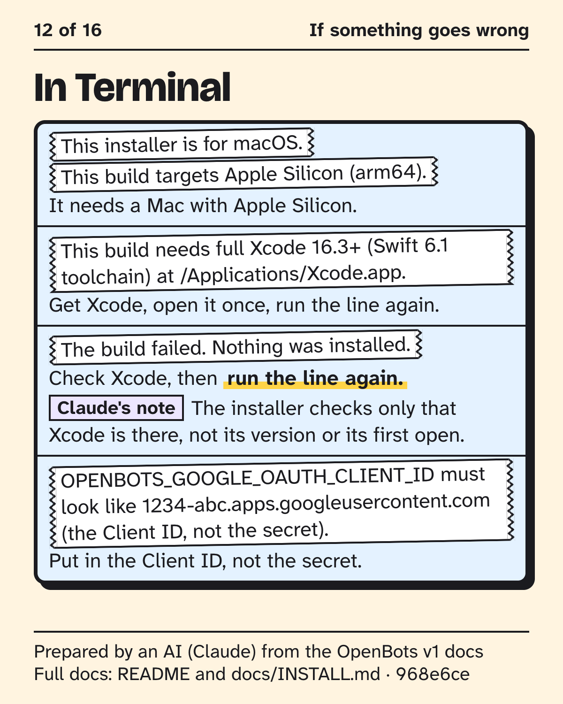

## 13 of 16 · If something goes wrong: in the app

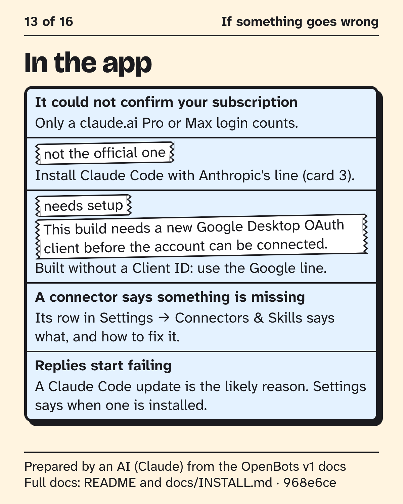

## 14 of 16 · If something goes wrong: at Google (only if you use Google)

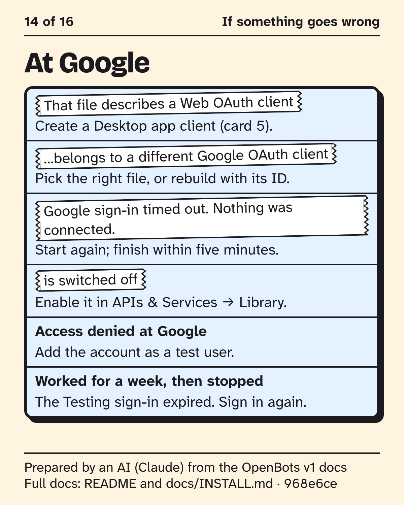

## 15 of 16 · What stays on your Mac

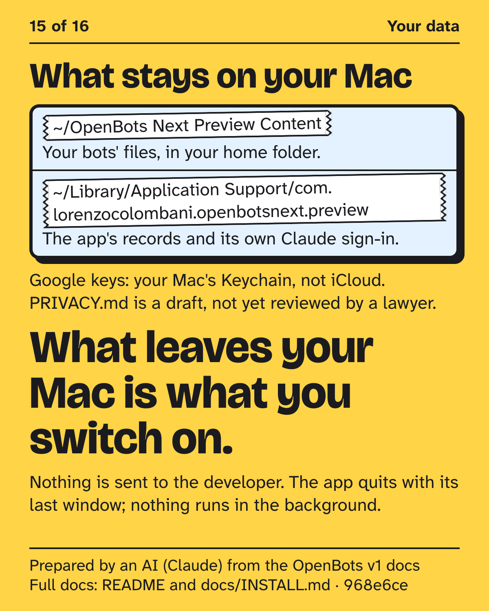

## 16 of 16 · Updating

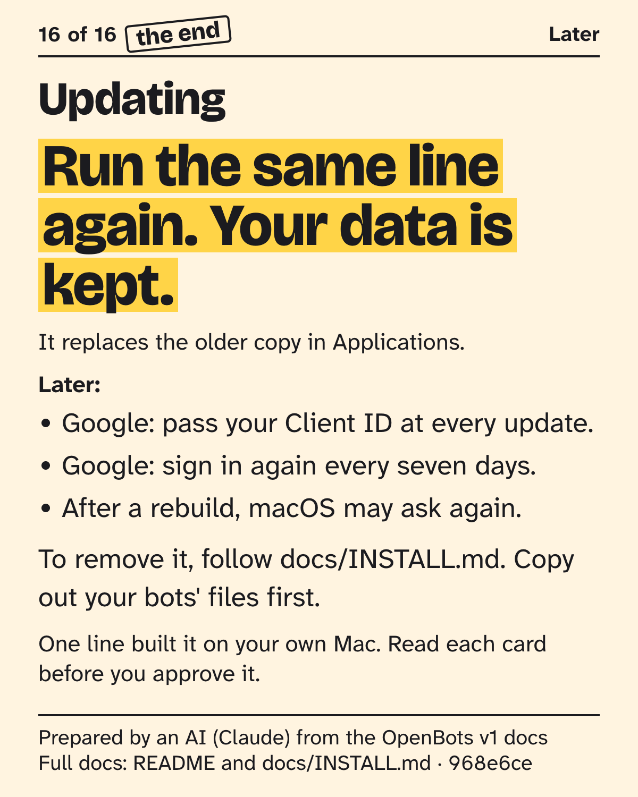
